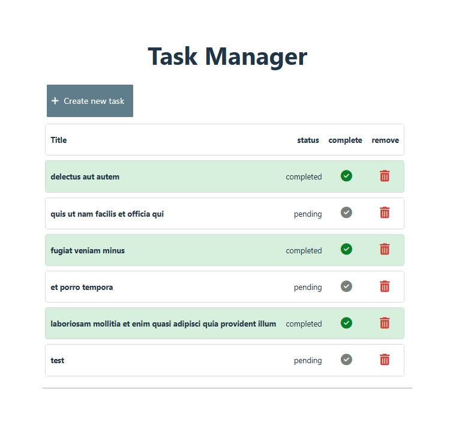

# React + Vite

This template provides a minimal setup to run a task manager system.

The app was built using Vite, React, Javascript and css. 

To install, clone this repository and run

`npm install`
`npm run dev`

## Node version
`v20.9.0`

# App

